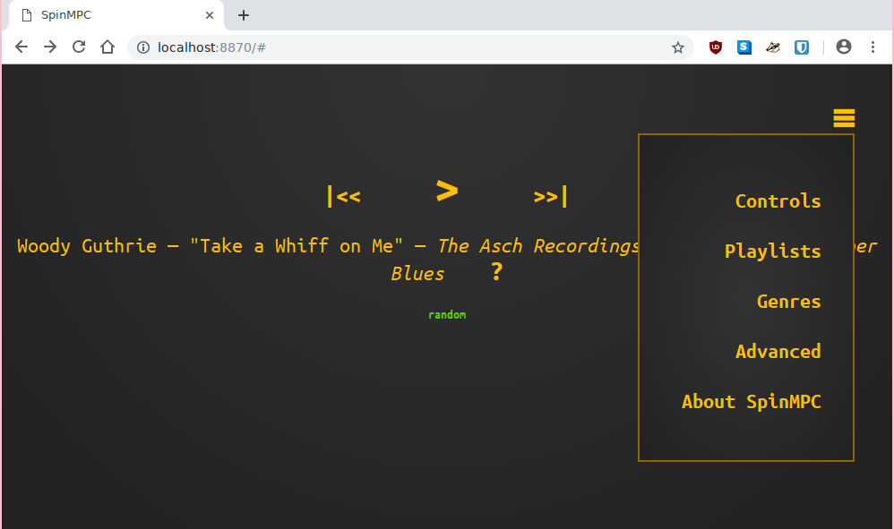

# SpinMPC #

SpinMPC is a simple web-based music player, a client for [mpd](https://www.musicpd.org/).
It's written in Go.

You may find SpinMPC too minimal for use as your everyday desktop music player.
That's OK.
SpinMPC's target use case is when you're hanging out with a bunch of friends, playing tunes from your media server.
With SpinMPC, any guest can use their own phone to check what's playing or skip to the next track without leaving the couch.



## Installation ##

Install MPD, and have it listen on a network port.
By default, MPD listens on port 6600.
See `mpd.conf(5)`.

Install a Go compiler.
See Go's [Getting Started](https://golang.org/doc/install).

Get SpinMPC and compile it:

```
$  go get github.com/fhs/gompd/mpd
$  go get github.com/pgorman/SpinMPC
$  cd $GOPATH/src/github.com/pgorman/SpinMPC
$  go install
$  $GOPATH/bin/spinmpc -d
```


## Configuration ##

With no configuration file, SpinMPC starts with reasonable defaults.

Configure SpinMPC by command-line flags.
See the available flags with:

```
$  spinmpc -help
```

For security, the MPD password (if any) may be given as an environment variable:

```
$  mpdpass="secret" spinmpc -d
```

## Troubleshooting ##

Enable debugging output with the `-d` flag.


## Links ##

- https://musicpd.org/
- https://musicpd.org/doc/protocol/
- https://wiki.archlinux.org/index.php/Music_Player_Daemon/Troubleshooting
- https://github.com/fhs/gompd
- https://paulgorman.org/technical/mpd.txt


## License (GPL) ##

SpinMPC copyright 2017 Paul Gorman, and licensed under the GNU General Public License.

https://www.gnu.org/licenses/gpl.html
